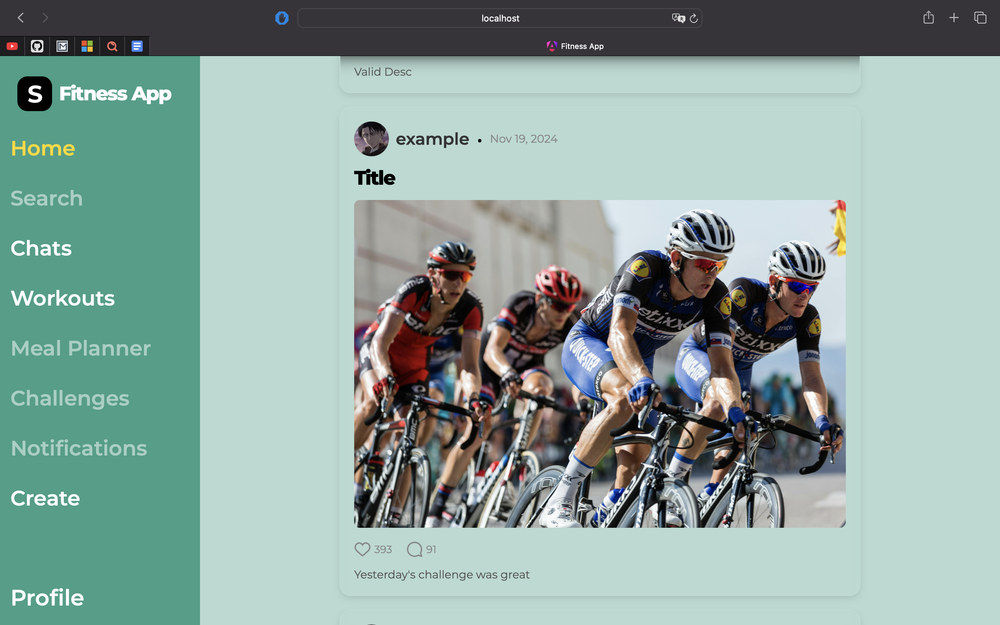
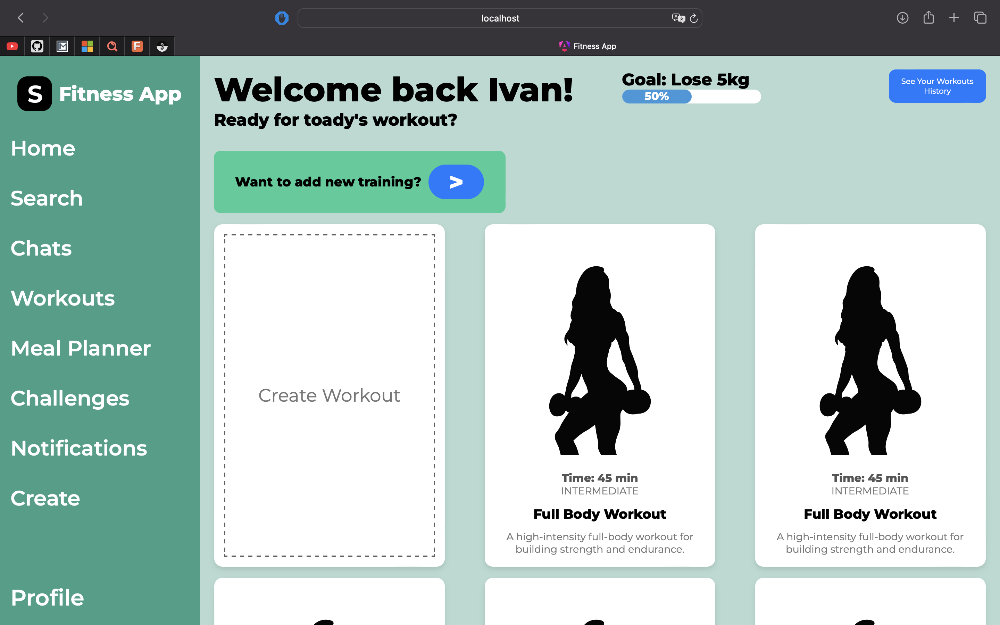
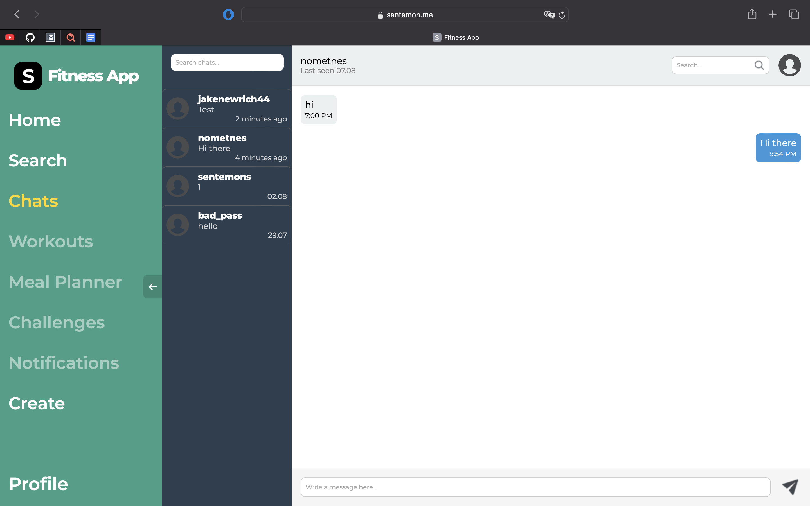

<p align="center">
  
</p>

<div align="center">
  <h1>Fitness App</h1>
</div>

<p align="center">
  <strong>A community-driven social network for fitness enthusiasts.</strong>
</p>

Fitness App empowers users to share posts, track workouts, plan meals, and engage in personal or group chats. The platform fosters collaboration through challenges, personalized training plans, and comprehensive profile systems, promoting an engaging fitness journey for all users.


---

## Required Software

- **.NET SDK 8.0 or later:** [Download here](https://dotnet.microsoft.com/en-us/download)
- **Angular CLI 18:** [Download here](https://angular.io/cli)
- **Docker Compose:** [Learn more](https://docs.docker.com/compose/)

---

## How to Run in Debug Mode

### Run Angular Client

*Instructions coming soon.*

### Run Required Containers

Use the provided `docker-compose.yml` to set up the infrastructure:

- **Keycloak**: Manage authentication and user roles.
- **PostgreSQL**: Relational database for core services.
- **RabbitMQ**: Message broker for inter-service communication.
- **Azurite**: Local emulation of Azure Blob Storage.

### Run .NET Services

*Instructions coming soon.*

---

## Microservices

- **Gateway:** Central entry point for routing requests.
- **Auth Service:** Handles user authentication and roles via Keycloak.
- **Post Service:** Manages posts and user interactions.
- **Workout Planner Service:** Helps users create and track workout plans.
- **Challenge Service:** Supports fitness challenges.
- **Trainer Service:** Connects users with trainers and personalized plans.
- **Chat Service:** Enables personal and group communication.
- **Notification Service:** Sends in-app, email, and push notifications.
- **File Storage Service:** Manages file uploads and storage via Azurite.
- **Frontend (Angular):** Modern, responsive user interface.
- **Keycloak:** External identity and access management solution.
- **PostgreSQL:** Primary database for storing data.
- **RabbitMQ:** Manages communication between microservices.
- **Azurite:** Simulates Azure Blob Storage locally.

---

## Infrastructure Diagram

*Coming soon.*

---

## Screenshots

- **Home**


- **Workouts**


- **Chats**


---

## Technology Stack

- **SDK:** .NET 8
- **Frontend Framework:** Angular 18
- **Identity Management:** Keycloak 26
- **Persistence:**
    - Database: PostgreSQL 15
    - Blob Storage: Azurite (latest)
- **Microservices Communication:** RabbitMQ 4
- **Containerization:** Docker, Docker Compose
- **Testing:**
    - Unit Tests: XUnit
    - Integration Tests: XUnit + TestContainers
- **Continuous Integration/Continuous Deployment (CI/CD):** GitHub Actions

---

## Useful Links

- Docker Images: https://hub.docker.com/u/sentemon

---

## How to Run Docker Compose

### Running the Services

- Run the following command to start the containers:

  ```bash
  docker-compose up
  ```

---

## Future Plans

- **Kubernetes Support:** Planned deployment and orchestration.
- **Azure Deployment:** Deploy the app on Azure
