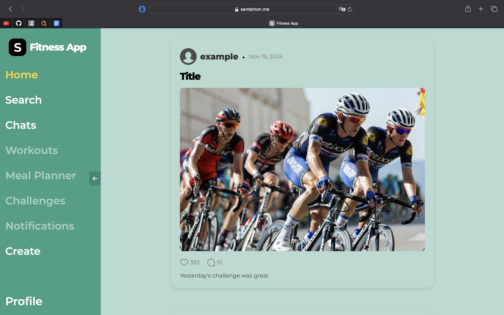

<p align="center">
  
</p>

<div align="center">
  <h1>Fitness App</h1>
  <strong>A community-driven social network for fitness enthusiasts.</strong>
</div>

## Description
Fitness App empowers users to share posts, track workouts, plan meals, and engage in personal or group chats. The platform fosters collaboration through challenges, personalized training plans, and comprehensive profile systems, promoting an engaging fitness journey for all users.

---

## Table of Contents
1. [Description](#description)
2. [Technology Stack](#technology-stack)
3. [Microservices](#microservices)
4. [Screenshots](#screenshots)
5. [Deployment](#deployment)
6. [Useful Links](#useful-links)
7. [Required Software](#required-software)
8. [Running in Debug Mode](#running-in-debug-mode)

---

## Technology Stack

* **SDK:** .NET 8
* **Frontend Framework:** Angular 18
* **Identity Management:** Keycloak 26
* **Persistence:** PostgreSQL 15, Azurite 3.35.0
* **Microservices Communication:** RabbitMQ 4
* **Containerization:** Docker, Docker Compose, Kubernetes
* **Testing:** XUnit, XUnit + TestContainers
* **CI/CD:** GitHub Actions

---

## Microservices

* **Frontend (Angular)** – modern, responsive user interface for users.
* **Gateway** – central entry point, routes requests to the appropriate services.
* **Auth Service** – manages users and roles, integrated with Keycloak.
* **Post Service** – handles creating and managing user posts.
* **Chat Service** – real-time messaging between users.
* **File Storage Service** – manages file and image storage via Azurite/Azure Blob Storage.
* **Workout Service** – helps users plan and track workouts. *(in progress)*
* **Notification Service** – sends notifications to users (email, push, in-app). *(in progress)*
* **Challenge Service** – supports fitness challenges and competitions. *(in progress)*
* **Meal Planner Service** – assists users in meal planning and tracking. *(in progress)*
* **PostgreSQL** – relational database for storing user and application data.
* **Keycloak** – external service for identity and access management.
* **RabbitMQ** – message broker for inter-service communication.
* **Azurite** – local Azure Blob Storage emulator.
* **Seq** – centralized logging and monitoring.
* **Nginx-proxy** – routes incoming requests to the correct service. *(for production)*
* **Nginx-letsencrypt** – automatic SSL certificate management. *(for production)*

---

## Screenshots

* **Login**

  

* **Home**

    

* **Search**

  

* **Chats**

  

* **Workouts**

  

* **Create Post**

  

* **Profile**

    

---

## Deployment

The Fitness App is deployed on **AWS EC2 instances** using Docker Compose.
The application is accessible via **[https://sentemon.me](https://sentemon.me)**

Highlights:

* **AWS EC2** – Hosting Dockerized microservices
* **Nginx + Let's Encrypt** – Reverse proxy with automatic SSL certificate management
* **Docker Compose** – Orchestration for local and production services
* **Monitoring & Logging** – Centralized via Seq

---

## Useful Links

* Docker Images: [https://hub.docker.com/u/sentemon](https://hub.docker.com/u/sentemon)

---

## Required Software

* **Docker Compose:** [Download here](https://docs.docker.com/compose/install/)

---

## Running in Debug Mode

1. **Clone the repository and navigate into it:**

```bash
git clone https://github.com/sentemon/FitnessApp.git
cd FitnessApp
```

2. **Build the Docker containers:**

```bash
docker-compose -f docker-compose.yml build
```

3. **Start the application:**

```bash
docker-compose -f docker-compose.yml up -d
```

4. **Stop the application:**

```bash
docker-compose -f docker-compose.yml down
```
